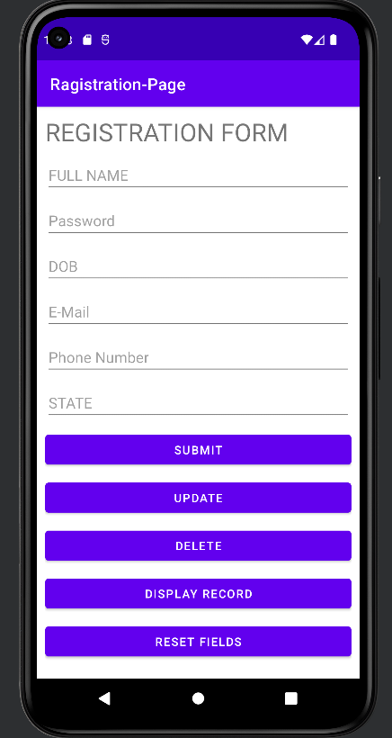
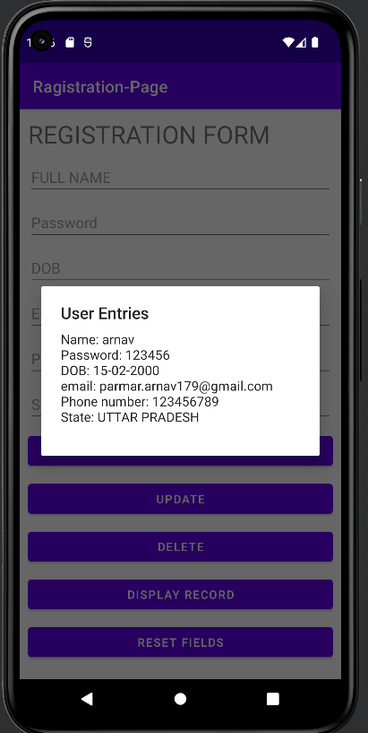
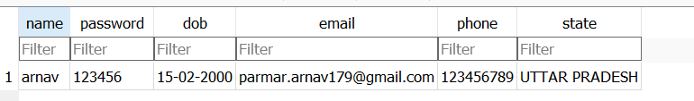

# Ragistration-Page
A simple registration page that takes the data from the user and stores it in a database
# ----------------
# TECHNOLOGY USED
1. ANDROID-STUDIO
2. SQLite
3. JAVA

# OUTPUT

# DATABASE-FILE

